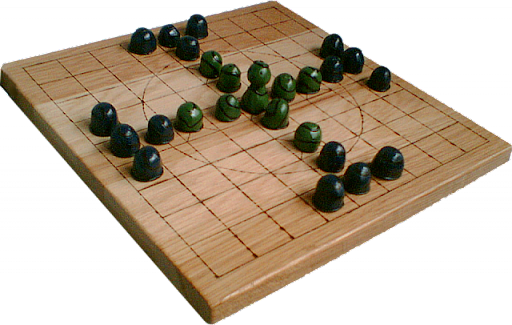

<h1 align="center">Tablut AI  challenge 2021</h1>
<p align="center">

<div align="center">
    
</div>

<br> 

A python minimax implementation to play Tablut. This piece of code has been realized in order to participate in the 2021 Tablut Competition for the Fundamentals of Artificial Intelligence course held at Unibo. Our team name was "TabulaRasa", hence the python script name.

# How to run

In order to play with white player:
```
tabularasa.py WHITE localhost
```
  
In order to play with BLACK player:
```
tabularasa.py BLACK localhost
```

### NOTE: the instructions assume the Tablut Challenge server is running
